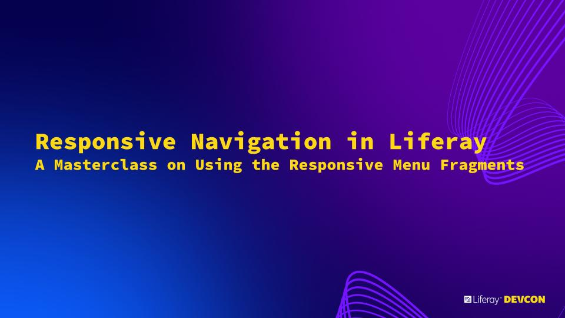
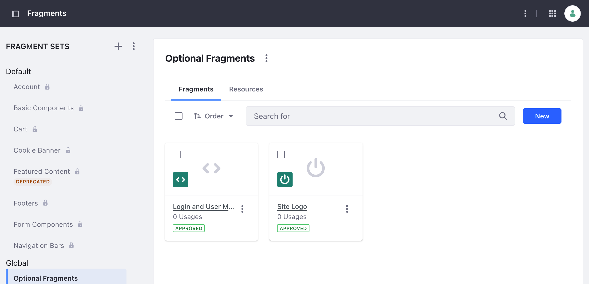
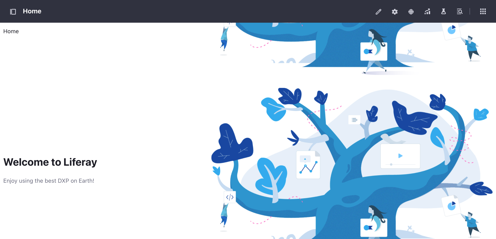
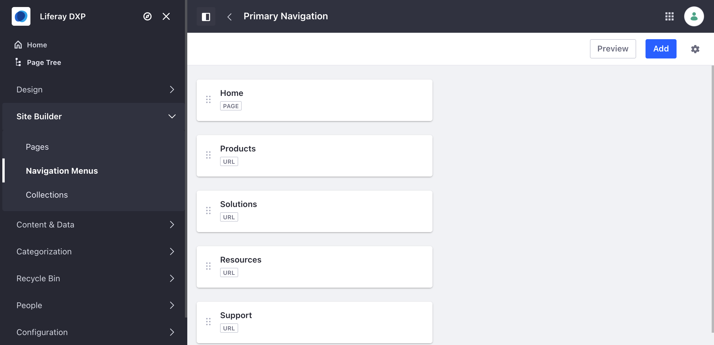
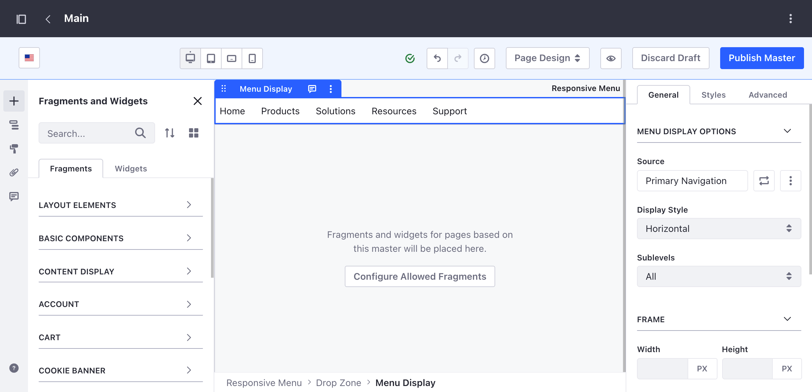
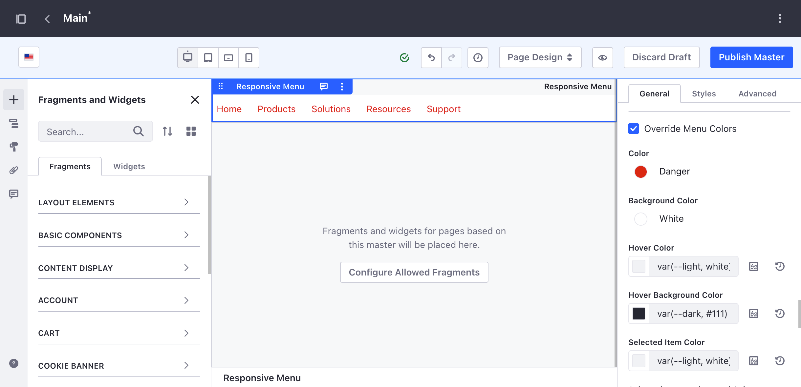
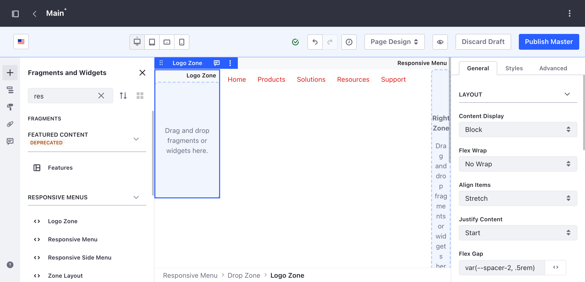
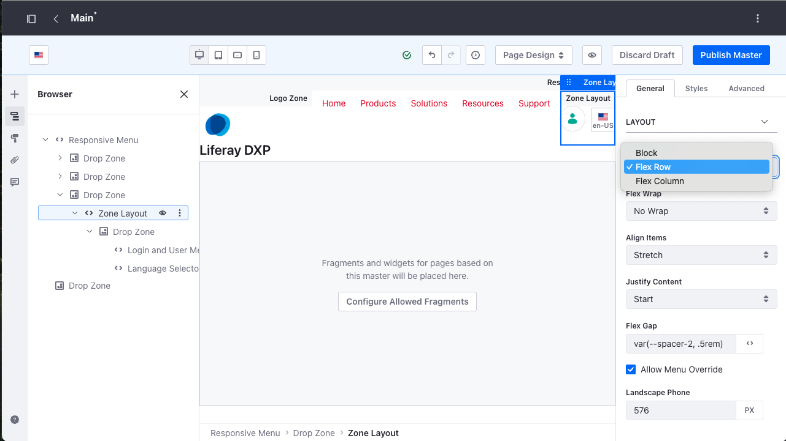
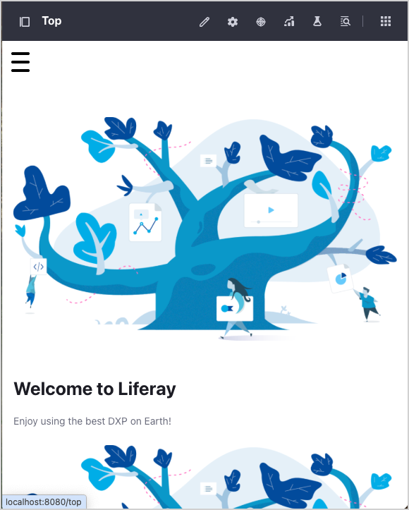

# Responsive Navigation in Liferay

## A Masterclass on Using the Responsive Menu Fragments

Welcome to this masterclass on creating responsive navigation in Liferay! In these exercises, you will learn how to use a collection of powerful, responsive menu fragments to build flexible and accessible navigation menus for your Liferay sites. These fragments are designed to be highly customizable and mobile-friendly right out of the box.

* [Prerequisite: Verifying and Launching Liferay Workspace](#prerequisite-verifying-and-launching-liferay-workspace)
* [Exercise 1: Install the Page Fragments](#exercise-1-install-the-page-fragments)
* [Exercise 2: Build a Responsive Menu](#exercise-2-build-a-responsive-menu)
* [Exercise 3: Customize Styles & Behaviour](#exercise-3-customize-styles-and-behaviour)
* [Exercise 4: Accessibility & Mobile Usability](#exercise-4-accessibility-and-mobile-usability)
* [Exercise 5: Adapt Menus for Layouts](#exercise-5-adapt-menus-for-layouts)
* [Optional Exercise: Uploading Language Properties](#optional-exercise-uploading-language-properties)

## Prerequisite: Verifying and Launching Liferay Workspace

*If you already have a fully configured Liferay Workspace, you can skip to the next lesson.*

Throughout this training, you’ll use a local Liferay environment. Here you’ll verify that you’ve completed the prerequisites and finish setting up your workspace:

1. Open your terminal and verify you have Java JDK 21.

    ```bash
    java -version
    ```

    If you don't have Java 21 installed, see [Microsoft OpenJDK installation](https://learn.microsoft.com/en-us/java/openjdk/download#openjdk-21) for instructions according to your OS.

2. Verify Git is installed:

    ```bash
    git version
    ```

    If Git is not installed, see [Git's official documentation](https://git-scm.com/downloads) for how to install it on your OS ([macOS](https://git-scm.com/download/mac)|[Windows](https://git-scm.com/download/win)|[Linux/Unix](https://git-scm.com/download/linux)).

3. Verify Liferay Blade CLI is installed:

    ```bash
    blade version
    ```

    If you don't have Blade installed, see [Blade CLI](https://learn.liferay.com/w/dxp/liferay-development/tooling/blade-cli) documentation for how to install it on your OS ([Linux/macOS](https://learn.liferay.com/w/dxp/liferay-development/tooling/blade-cli#installing-from-the-cli)|[Windows](https://learn.liferay.com/w/dxp/liferay-development/tooling/blade-cli#installing-from-the-graphical-installer)).

4. In your terminal, go to your desired folder and create a new Liferay worksapce:

    ```bash
    blade init responsive-menu-fragments
    ```

    If you prefer to use an LTS version, then select the latest 2025 Q1 patched release. If you want to use the Liferay Marketplace integration, then select the latest 2025 Q3 release.

5. Go to the workspace's root folder in your terminal:

    ```bash
    cd responsive-menu-fragments/
    ```

6. Initialize your Liferay bundle:

    ```bash
    blade server init
    ```

    If you don't have Blade installed, run this command:

    * **Unix-based systems**:

        ```bash
        ./gradlew initBundle
        ```

    * **Windows**:

        ```bash
        .\gradlew.bat initBundle
        ```

    This downloads and builds dependencies for running Liferay, including the Liferay server.

7. Start your Liferay server:

    **Blade**:

    ```bash
    blade server run
    ```

    * **Unix-based systems**:

        ```bash
        ./bundles/tomcat/bin/catalina.sh run
        ```

    * **Windows**:

        ```bash
        .\bundles/tomcat/bin/catalina.bat run
        ```

    **Tip**: Wait until you see `org.apache.catalina.startup.Catalina.start Server startup in X milliseconds` to indicate startup completion.

8. When finished, access your Liferay DXP instance by going to [http://localhost:8080/](http://localhost:8080/) in your browser.

9. Sign in using these credentials:

    * Username: `test@liferay.com`
    * Password: `test`

## Exercise 1: Install the Page Fragments

**Goal:** Install the Responsive Menu Fragments

**Steps:**

The steps you will follow will depend on the version of Liferay you have installed.

### 2025 Q1 LTS

1. Log into - or create - your Liferay Marketplace account.
2. Search for the **Responsive Menu fragments**.
3. Select **Get App**.
4. If your user accounts are linked to multiple accounts, you well need to select which account to use.
5. Review and accept the End User Licence Agreement and Terms of Service and select **Get App**.
6. From the confirmation screen, navigate to **My Apps**.
7. Using the **Context Menu (⋮)** download the app.
8. Navigate to the **Fragments** screen in the **Global** site.
9. Using the **Context Menu (⋮)** next to **Responsive Menu**Fragment Sets, use **Import** option to install the downloaded zip.

### 2025 Q3

1. Navigate to the **Fragments** screen in the **Global** site.
2. Complete the Marketplace connection steps shown earlier in the presentation (Liferay Marketplace Installation).
3. Install the **Responsive Menu Fragments** directly from the Marketplace UI.

### Offline

Use this option if you do not have an internet connection during the masterclass.

1. Navigate to the **Fragments** screen in the **Global** site.
2. Using the **Context Menu (⋮)** next to **Fragment Sets** and slect **Import**.
3. Choose the **responsive-menu-collections.zip** file included in the **resources** folder of this GitHub repository.

### Optional: Install the Supporting Fragments

These additional fragments are not required for the exercises, but they provide useful enhancements when working with the Responsive Menu Fragments.

The ZIP file contains:

* **Login and User Menu** fragment – a pre-configured user menu + login trigger.
* **Site Logo** fragment – an enhanced version of the standard logo fragment that allows the Responsive Menu Fragments to control sizing and behaviour on smaller breakpoints.

**Steps:**

1. Navigate to the **Fragments** screen in the **Global** site.
2. Open the **Context Menu (⋮)** next to**Fragment Sets** and slect **Import**.
3. Choose the **supporting-fragments.zip** file included in the **resources** folder of this GitHub repository.

Once imported, these helper fragments will be available for use in later exercises.



Great! Now you're ready to start using the Responsive Menu fragments.

## Exercise 2: Build a Responsive Menu

**Goal:** Use the **Responsive Menu** fragment to create a sticky menu at the top of a master page.

**Steps:**

1. Navigate to the **Design** -> **Page Templates** section in the Site Menu.
2. Create a new **Master Page Template**.
3. Add the **Responsive Menu** fragment to the top of the page.

    

4. In the fragment's configuration, under the **General** tab, set the **Menu Style** to **Sticky Top**. This will make the menu stick to the top of the page when scrolling.

5. The fragment provides a dropzone labeled **Menu**. Drag and drop the out-of-the-box **Menu Display** fragment into this dropzone. This will populate the menu with your site's navigation.

    > **Note:** These responsive menu fragments provide dropzones for you to add additional content. While you would typically use the out-of-the-box Menu Display fragment, you could use a different fragment or build your own.

6. Publish the Master Page and apply it to your site's pages to see the sticky menu in action.

    > **Note:** An quick way to see the sticky menu in action is to duplicate the container that holds the Welcome content in the Home page. Open its **Context Menu (⋮)** and choose **Duplicate** to create one or more copies. This gives you enough vertical content on the page to test the sticky behaviour.

### ✔️ Apply the Master Page to Content Pages

1. Go to **Site Menu → Pages**.
2. Select a **Content Page**.
3. Open the **Look and Feel** panel in the sidebar.
4. Under **Master Page**, choose the Master Page you created.
5. Publish the page.

    > **Note:** Setting a Master Page as Default only affects **Widget Pages**. **Content Pages always require manually selecting the Master Page**. This is expected behaviour and is documented in Liferay Learn. See Liferay Learn: [Managing Master Page Templates](https://learn.liferay.com/w/dxp/sites/creating-pages/defining-headers-and-footers/managing-master-page-templates)

    

    > **Note:** If you have logged out of your Liferay instance, you may not see an option to login again. In this case, you can login by using the follow path /c/portal/login/.

## Exercise 3: Customize Styles and Behaviour

**Goal:** Customize the appearance and behavior of the responsive menu, especially for mobile devices.

**Steps:**

Before customizing the Responsive Menu, create a primary navigation for your site:

1. Navigate to **Site Menu → Navigation Menus**.
2. Select **Add → Navigation Menu** and name it **Primary Navigation**.
3. Open the new Primary Navigation and select **Add → Page**.
4. Add the existing **Home** page to the menu.
5. Add 3–4 additional menu items by selecting **Add → Link**:
   * Name the items something like **Products**, **Solutions**, **Resources**, **Support**.
   * For each item, set the URL to **<https://liferay.com>**.

    

6. Ensure the menu is marked as **Primary Navigation** by using the **Mark as Primary Navigation** option in the Primary Navigation's **Context Menu (⋮)**.
7. Navigate to your **Master Page Template** and select the **Menu Display** fragment inside the Responsive Menu.
8. In the fragment configuration, under **Navigation Menu**, choose the **Primary Navigation** menu you created.

    

9. Select the **Responsive Menu** fragment on your Master Page.
10. In the configuration panel, explore the **Menu Colors** section. Enable **Override Menu Colors** to change the default colors of the menu items, including their hover and selected states.

    

11. To add a logo, drag the **Logo Zone** fragment into one of the available dropzones within the **Responsive Menu** (e.g., the left zone). You can then add a logo image within the **Logo Zone**.

    

    > **Note:** For more complex layouts, use the **Zone Layout** fragment. This fragment can be dropped into the responsive menu's dropzones and allows you to create flexible layouts using CSS flexbox properties, which can be configured in the fragment's settings. This is particularly useful for controlling the alignment and spacing of elements in the mobile view.

12. Add the **Zone Layout** fragment into one of the avalable dropzones.
13. Drop a couple of components into the Zone Layout, such as the Login and User Menu fragment and Language Selector widget
14. Configure the **Content Display** to **Flex Row** and ensure **Allow Menu Override** is checked.
15. Publish the Master Page and see how the Responsive Menu fragment adapts the mobile breakpoint to accommodate these components. Try changing the **Allow Menu Override** setting and see how it affects the layout.

    

16. Experiment with the **Breakpoints** section in the **Responsive Menu** configuration to control how the menu appears at different screen sizes.

    

## Exercise 4: Accessibility and Mobile Usability

**Goal:** Explore the built-in accessibility and mobile usability features of the responsive menu fragments.

**Steps:**

1. View your page on a mobile device or by resizing your browser window. Notice how the menu collapses into a hamburger icon.

    

    

2. The mobile menu is fully keyboard navigable. Use the `Tab` key to navigate through the menu items and `Enter` to select them.

    

3. The fragment also includes features like **Scroll Lock** (under the **Behavior** tab), which prevents the page from scrolling when the mobile menu is open, and **Close on Internal Nav**, which automatically closes the menu after navigating to a page section.
4. The **Scroll back to top** feature can be enabled to provide an easy way for users to return to the top of the page.

## Exercise 5: Adapt Menus for Layouts

**Goal:** Explore other menu variations and advanced features.

**Steps:**

1. In the **Responsive Menu** configuration, change the **Menu Style** to **Inline**. This will display the menu items inline with other content, which is useful for secondary navigation or menus within a page layout.

    

2. For vertical navigation, use the **Responsive Side Menu** fragment. This can be placed on the left or right side of the page and also supports sticky positioning.

    

3. The fragments support Right-to-Left (RTL) languages. If your site uses an RTL language, the menus will automatically adjust their layout. You can test this by adding an RTL language to your site and viewing the page.

    

---

## Optional Exercise: Uploading Language Properties

This optional step replaces placeholder labels in Liferay with the correct text, which will improve the user experience.

**Steps:**

1. Navigate to the **Control Panel** -> **System** -> **Language Override**.
2. Click the **(+)** button to add a new language override.
3. From the dropdown menu, select **Upload**.
4. Select the `Language_en_US.properties` file from the `resources` folder of this project.
5. Click **Publish**.

---

&nbsp;

## Congratulations

Congratulations! You have now learned how to use the responsive menu fragments to create a variety of navigation experiences in Liferay. You've seen how to build a sticky top menu, customize its appearance, ensure it's accessible, and adapt it for different layouts. With these skills, you can now create powerful and flexible navigation for your Liferay sites.
